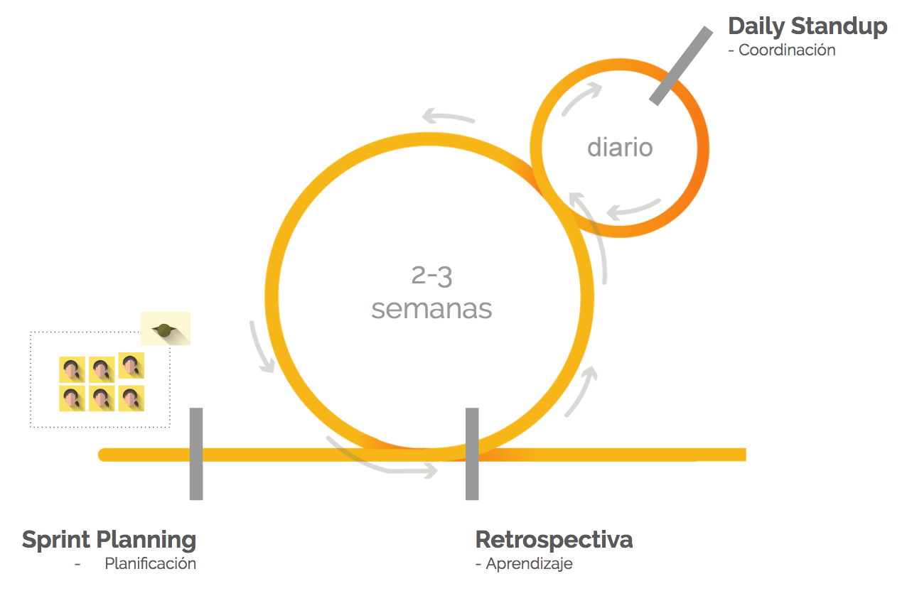

# Web Development Bootcamp 2017

Estimado `<laboratorian>`, esta es la currícula detallada del programa intensivo de 6 meses.

## Sprints

Las clases en Laboratoria están basadas bajo la cultura agile, a esto lo llamamos el [Agile Classroom](https://medium.com/laboratoria/the-agile-classroom-embracing-an-agile-mindset-in-education-ae0f19e801f3#.axndrsvx7).

Los sprints que se ven durante el Bootcamp son:

No.  | Sprint
---- | ------
Demo | [Agile](./sprint-demo/README.md)
0    | Fundamentos de Programación
1    | Introducción a Ciencias de la Computación